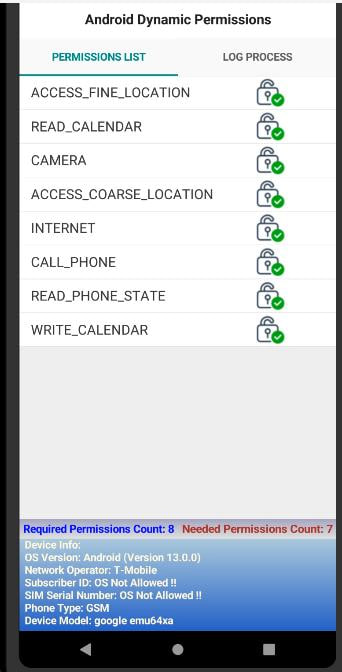

# AndroidDynPermissions
 Delphi Android Dynamic Permissions

This class allows Delphi developers to safely handle Android permissions without risking app crashes when making permission requests during form creation or in overridden constructors. It dynamically retrieves permissions from the Android runtime manifest in their required order, ensuring the app remains stable. This careful ordering is crucial for preventing crashes during permission handling.

Enjoy using it! Don't forget to star the project or contribute by reporting issues if you find any!
-----
comming soon Major Updates:
# Permission Management Structure
1. Normal Permissions (fNormalPermissions):
   Permissions that are automatically granted by the OS without user interaction. These permissions vary between different Android versions and are considered safe (e.g., permissions with PROTECTION_NORMAL flag). They do not require user approval and are processed automatically.

2. Permissions Requiring User Consent (fPermissionsNeedingUserInvocation):
   These permissions are marked as "dangerous" or require explicit user consent. They may trigger runtime permission prompts, and if denied, the app should display a rationale dialog explaining their importance and encouraging the user to grant them. This list handles permissions like access to contacts, location, or camera.

3. Unimplemented Permissions (fUnrecognizedPermissions):
   This list includes permissions that are not recognized by the current OS because they are designed for newer Android versions. These permissions exist in the manifest but cannot be invoked on older OS versions (e.g., targeting SDK 34 while running on API level 21). They are filtered after querying the PackageManager for permission details.

4. Denied Permissions (fDeniedPermissions):
   This list holds permissions that have been explicitly denied, either by the user or restricted by the OS. It includes:

5. User-denied permissions: 
   If the user rejects a dangerous permission request.
OS-enforced restrictions: Permissions that are no longer accessible to regular apps.
These permissions are essential for generating user-friendly notifications or prompts to encourage reconsideration.

Implementation Notes:
   The permission structure dynamically adapts based on the API level, ensuring compatibility from Android API 21 to 34.
User interface like TListView components should categorize these lists to provide users with clear explanations of the permission states.
The permission management logic ensures a smooth experience for both developers and users, minimizing crashes and maximizing functionality across diverse Android versions.
